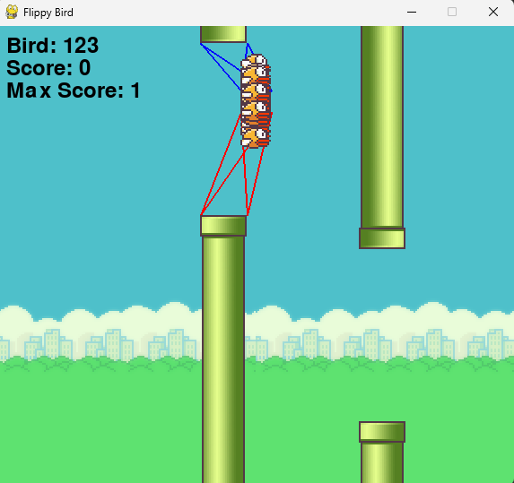

# Flappy Bird Game with AI



## Description

This project features a Flappy Bird game implemented in Python using Pygame. It offers two modes of play:
- **Single Player Mode**: Controlled by a human player.
- **AI Mode**: Controlled by a neural network using the NEAT (NeuroEvolution of Augmenting Topologies) algorithm.

## Files

1. **`run.py`**: This file allows you to play the game in single-player mode.
2. **`run_ai.py`**: This file allows the NEAT AI to play the game.

## Requirements

To run this project, you'll need the following Python packages:

- `pygame`: For the game interface.
- `neat-python`: For the NEAT algorithm implementation.

You can install these packages using the following command:

```bash
pip install -r requirements.txt
```

## How to Run

Single Player Mode

To play the game in single-player mode, run the following command:

```bash
pip install run.py
```

AI Mode

To watch the NEAT AI play the game, run the following command:

```bash
pip install run_ai.py
```

The AI will start learning to play the game using the NEAT algorithm. You can observe the evolution process and how the AI improves over generations.